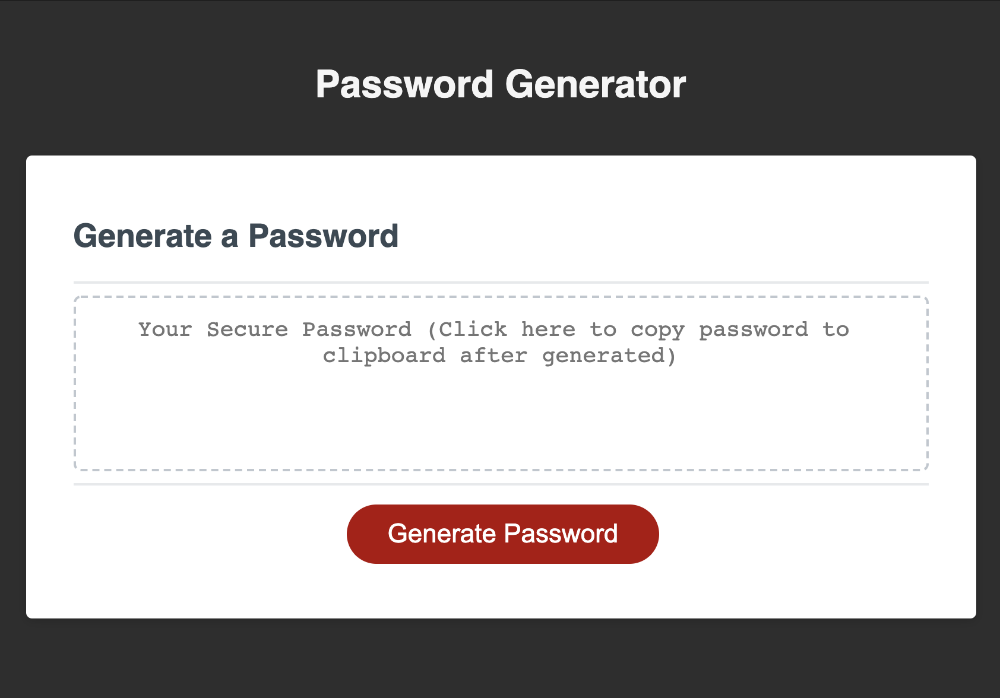
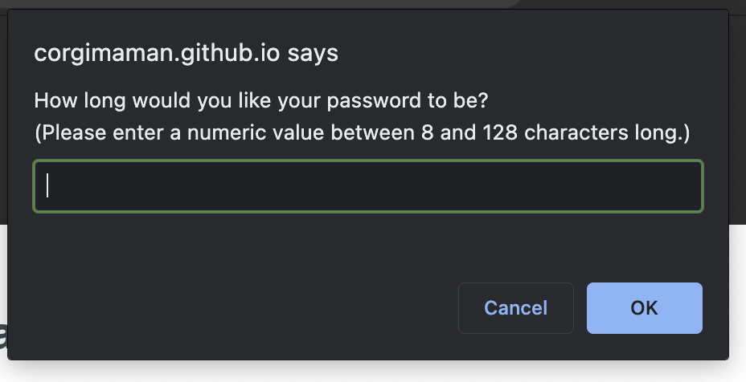
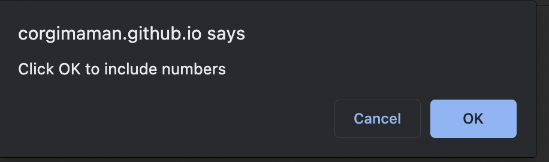
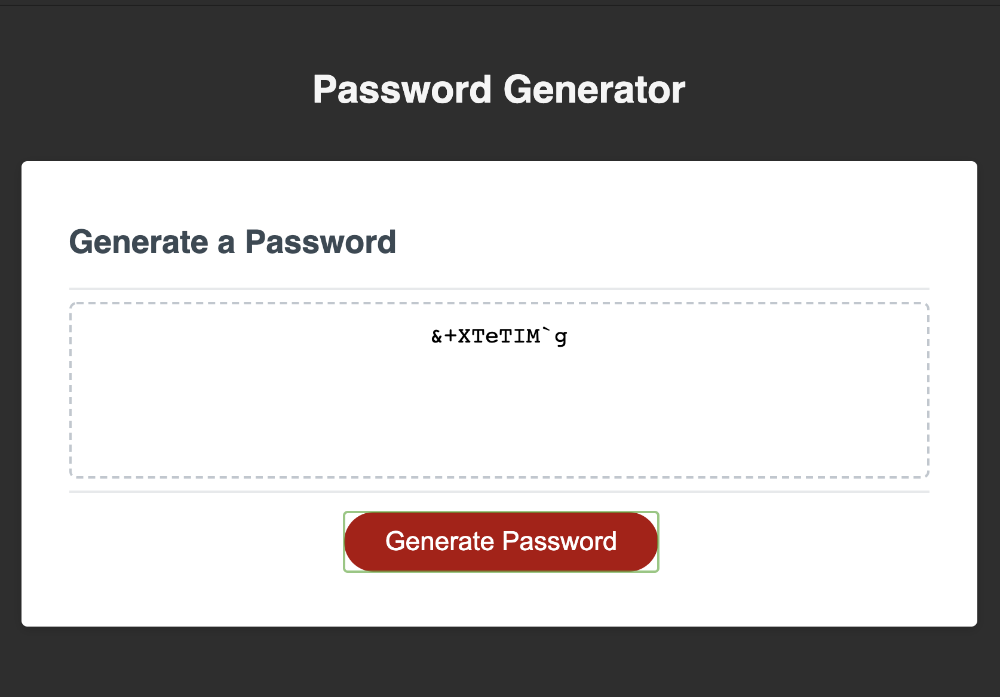
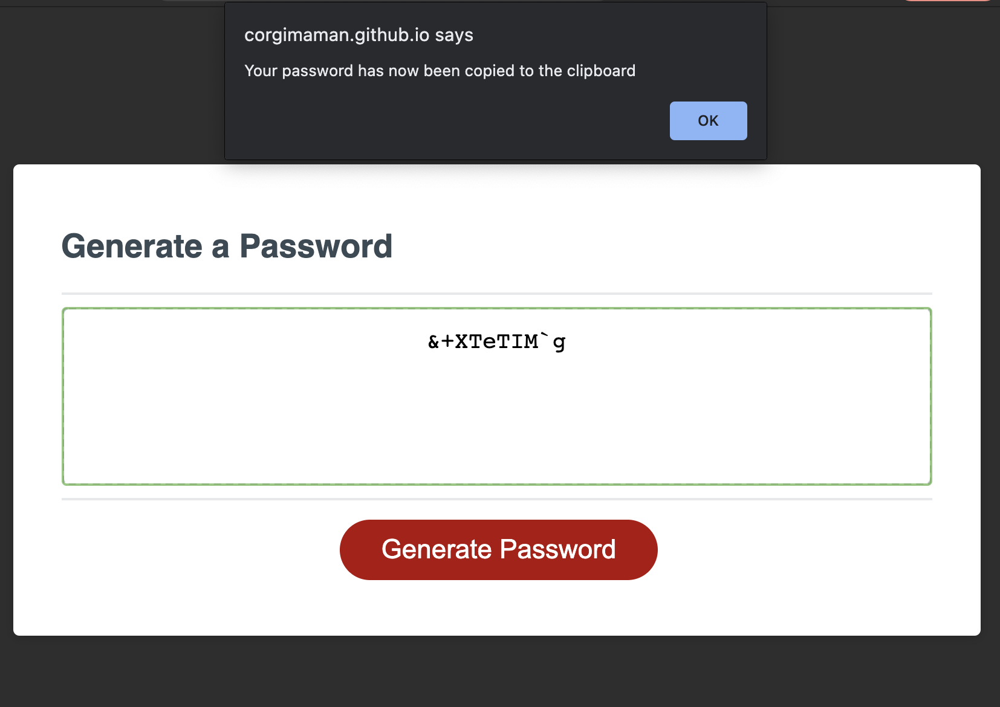

# [Secure Random Password Generator](https://corgimaman.github.io/passwordgenerator/)
This is a secure random password generator that uses JavaScript prompts to recieve input from the user on how to randomize the password. The password can generate based on the following options:

* Length (From 8 to 128 characters long)
* Be a mix of:
    * Lowercase letters
    * Uppercase letters
    * Numbers
    * Symbols

The password will copy to the user's clipboard once the password textbox area is clicked.

## How to Use:
1. Click the Generate Password Button

2. A prompt will open asking for how long you'd like your password to be. Please enter this as a numeral value between 8 and 128.

3. Next, a series of 4 prompts will run to ask if you'd like lowercase, uppercase, numbers, and symbols to be included in your random password. You don't need all 4, but you do need at least 1.

4. Once your options have been selected, your password will generate in the text box.

5. Clicking anywhere inside that textbox will copy the password to your clipboard, and a prompt will show to confirm.

And that's it! ☺️

## What I learned...
In doing this project, I learned how to:
- Use the map function to change the lowercase array to uppercase
- Use JavaScript prompt boxes (parseInt, prompt, alert, confirm)
- Use a JavaScript object
- Use JavaScript functions
- Use empty arrays and strings to be placeholders
- Use the concat function and +=
- Use eventListeners
- Query the DOM
- Use math functions

and just USE JavaScript. Since this was my first time working with it, I learned so much doing this project. Plus, I got to create a very powerful and useful tool.